## Text Mining The Hobbit

After recently finishing J.R.R. Tolkien's *The Hobbit*, I wanted to dive
further into Tolkien’s world by trying my hand at text mining the book
in R. Without any previous text mining experience or goals for the
project, I decided to do what any reasonable person would do and I
looked to the internet for help. After reading a text mining with R
[e-book](https://www.tidytextmining.com/), this R-Bloggers Metallica
lyric analysis
[post](https://www.r-bloggers.com/hardwired-for-tidy-text/), and this
Data Camp text mining blog
[post](https://www.datacamp.com/community/blog/text-mining-in-r-and-python-tips),
I had some idea of what I wanted to do. I think in the end the analysis
went well enough, if not a little bit long, but you be the judge.

This text project is broken into three parts – a traditional word
frequency analysis, a character analysis, and a sentiment analysis.
[Here](https://archive.org/stream/TheHobbitByJ.R.RTolkien/The%20Hobbit%20by%20J.R.R%20Tolkien_djvu.txt)
is the copy of the hobbit that I'm using if you want to follow along.
Without further ado – here's hobbits.

 

Load Libraries

    library('tidyverse')    # used for EVERYTHING
    library('stringr')      # used for string (text) manipulation
    library('tidytext')     # used for text mining
    library('wordcloud')    # used for creating cool text visualizations

 

Load Data

    the_hobbit <- as.tibble(read_file("input/hobbit_body.txt")) 

 

Tidy Data

    tidy_hobbit <- the_hobbit %>%      # copy the_hobbit text into tidy_hobbit
      unnest_tokens(word, value) %>%   # each word is given a cell in tibble
      anti_join(stop_words)            # take out meaningless words like a, to, and it

 

View Data

    head(the_hobbit)

    ## # A tibble: 1 x 1
    ##   value                                                                   
    ##   <chr>                                                                   
    ## 1 "Chapter I \r\rAN UNEXPECTED PARTY \r\rIn a hole in the ground there li…

    head(tidy_hobbit)

    ## # A tibble: 6 x 1
    ##   word      
    ##   <chr>     
    ## 1 chapter   
    ## 2 unexpected
    ## 3 party     
    ## 4 hole      
    ## 5 ground    
    ## 6 lived

A quick note: I cleaned up the hobbit text to start at Chapter 1 and end
the finish of the last chapter before I saved it as an input file.
*head(the\_hobbit)* reveals a 1x1 table with the entire novel stored as
a single string in the tibble. This formatting has some uses so I'll
keep a copy of it, but the transformed text, *tidy\_hobbit* is even more
useful.

*tidy\_hobbit* has cut out some words - in, a, in, the, there, and so
on. That's the *anti\_join(stop\_words)* at work. *anti\_join( )* is a
*dplyr* function loaded from the tidyverse, it's job is to return all
rows from x where there are not matching values in y. In this case x is
*the\_hobbit*, y is *stop\_words*, a tibble from the tidytext library.
Also notice that now each word has it's own row in the tibble, pretty
tidy.

 

### Word Frequency

 

How many words are in *The Hobbit*?

    str_count(the_hobbit, " ") + 1

    ## [1] 95874

 

How many sentences?

    str_count(the_hobbit, "[.!?]")

    ## [1] 5967

 

How long should the book take to read?

    ((str_count(the_hobbit, " ") + 1) / 200) / 60 # number of words / 200 words-per-minute / 60 minutes

    ## [1] 7.9895

 

#### Frequency Plot

What are the most common meaningful words in *The Hobbit*? To find out,
let's create a frequency plot. These graphs that illustrate counts of
various categories are some of my favorite to create.

    tidy_hobbit %>%
      count(word, sort = TRUE) %>%          # count words
      filter(n > 80) %>%                    # only show words that have been used 80+ times
      mutate(word = reorder(word, n)) %>%   # sorts words by decending occurance
      ggplot(aes(word, n)) +                # plot the words vs number of occurances
        geom_col(fill = "darkslateblue") +  # blue bars
      xlab("Word") +                        # labels
      ylab("Number of Occurances") + 
      labs(title = "Most Common Meaningful Words in 'The Hobbit'") +
      coord_flip() +                        # sideways box-plot for aestetic purposes
      theme_minimal()                     

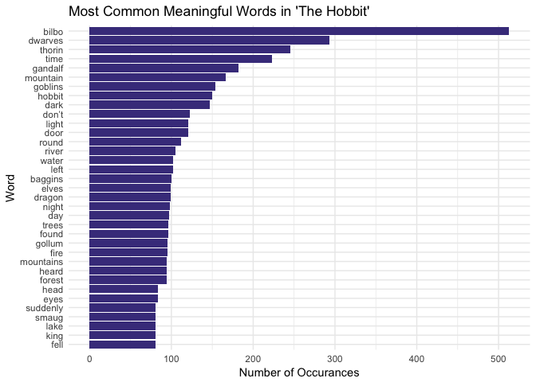

The most common words in *The Hobbit* are Bilbo, dwarves, Thorin, time,
and Gandalf. The only non-character word is time, but I bet the word
time is common enough in most novels. I'm surprised to see the word
"don't" on the list, I thought it was classified as a stop word. There
isn't much to be surprised about on this list if you've read the book,
and If you haven't read the book, the list gives you a pretty good idea
of what to expect!

Now this plot is pretty cool and informative, but can we make it more
artsy?

 

#### Word Cloud

    hobbit_cloud <- tidy_hobbit %>%
      count(word) %>%                                      # provide a count of each word
      with(wordcloud(word, n, max.words = 100,             # using the wordcloud library, plot word, according to n (number of count), with 100 maximum words)
                     color = brewer.pal(n = 8,"Set1")))    # use RColorBrwer pallete 'Set1'

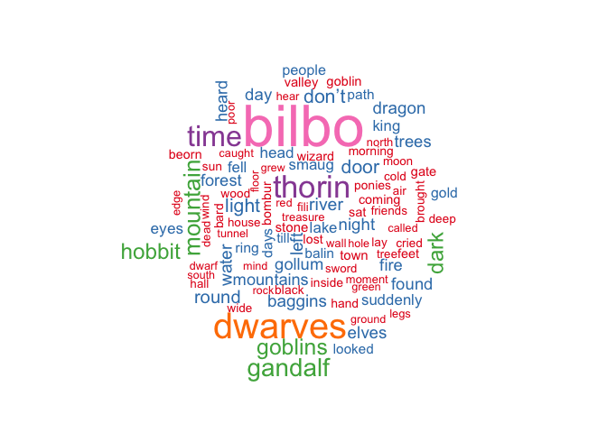

Here’s the more artsy (and less informative) word cloud! These are the
top 100 words used in *The Hobbit*. I’m not sure what’s with the color
coding, but the size of the word is dependent on its number of
appearances in the book.

 

Character Analysis
------------------

Now let's dig into the main characters of the novel. Who are the most
important characters and where do they appear most in the book?

 

#### Main Character Count

    main_chr <- as.tibble(c("bilbo", "thorin", "gandalf", "smaug", "gollum", "bard")) %>%
      unnest_tokens(word, value)      # defining the main characers

    colnames(main_chr) <- "word"      # naming the column of characters

    main_chr_num <- tidy_hobbit %>%   # moving tidy_hobbit to a new var
      semi_join(main_chr, "word") %>% # only keep tidy_hobbit lines that have main_chr
      count(word, sort = TRUE) %>%          # count presence of each character
      mutate(word = reorder(word, n)) %>%   # reorder characters by number of occurance
      ggplot(aes(word, n)) +                # plot the results
        geom_col(fill = "darkslateblue") + 
        labs(title = "Main Characters in 'The Hobbit'") + 
        xlab("Character") + 
        ylab("Count")
    main_chr_num

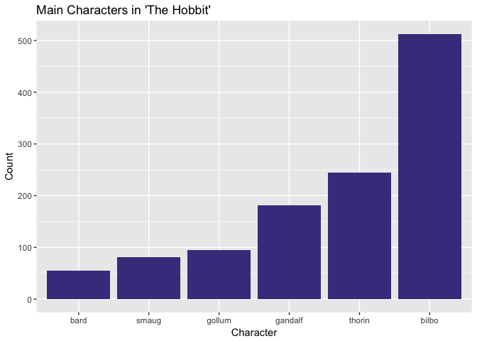

As we saw in the word frequency plot, Bilbo is not only the most
important character out of the six I've listed, but his name is the most
common word in the entire book. Life is good being the protagonist!
Thorin the dwarf king is mentioned some 250 times, and Gandalf is
mentioned under 200 times. I would have thought Gandalf played a bigger
role than Thorin, but I guess the counts don’t lie. Gollum, Smaug, and
Bard are comparatively minor characters.

 

    tidy_hobbit$linenumber <- 1:nrow(tidy_hobbit)  # label 'linenumbers'

    main_chr_pres <- tidy_hobbit %>%       
      semi_join(main_chr, "word") %>%       # keep only the six main characters in the hobbit text
      ggplot() + 
      geom_point(
        aes(word, linenumber)              # plot character name and linenumber they appear in
      ) + 
      labs(title = "Main Character Apperances in 'The Hobbit'") +
      xlab("Character") + 
      ylab("")+
      coord_flip() + 
      theme_minimal() + 
      theme(axis.title.x=element_blank(),
            axis.text.x=element_blank(),
            axis.ticks.x=element_blank())
    main_chr_pres

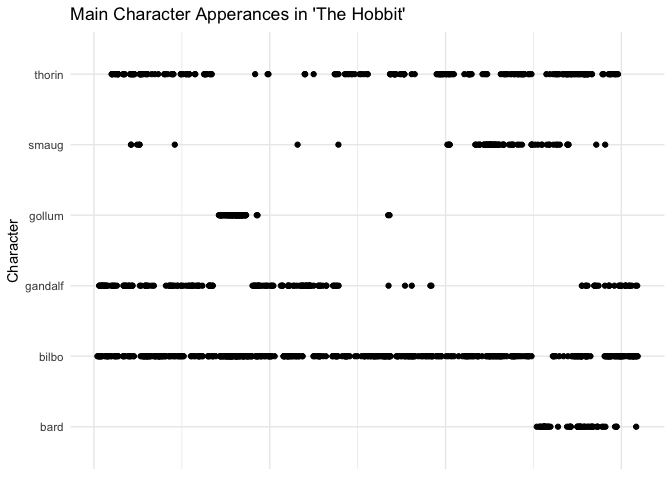

By the looks of it, Bilbo is basically mentioned every other sentence.
There are two small gaps in Bilbo’s presence near the end of the book
where Bard takes the center stage for a bit. Devilish ol’ Smaug is
briefly mentioned in the first half of the book, something along the
lines of "oh, there's also a dragon guarding the gold but don't worry
about it until later". Gandalf makes three dramatic apperances
throughout the tale, he does an interesting timeline, he has three solid
appearances in the tale, sitting out for the stories climatic
Smaug-burglary.

 

#### Dwarf Character Count

    dwarf_chr <- as.tibble(c("dwalin", "balin", "kili", "fili", "dori", "nori", "ori", "oin", "gloin", "bifur", "bofur", "bombur", "thorin")) %>%                      # a list of the 13 dwarves
      unnest_tokens(word, value)   

    colnames(main_chr) <- "word"        # label the values column "word"

    dwarf_chr_num <- tidy_hobbit %>%   
      semi_join(dwarf_chr, "word") %>%  # keep only the dwarves names from the main text
      count(word, sort = TRUE) %>%      # sort the dwarves by apperance count
      mutate(word = reorder(word, n)) %>%
      ggplot(aes(word, n)) + 
        geom_col(fill = "darkslateblue") + 
        labs(title = "Dwarves in 'The Hobbit'") + 
        xlab("Dwarf") + 
        ylab("Count")
    dwarf_chr_num

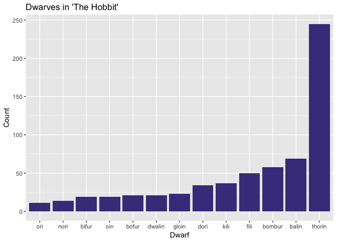

Poor Ori is only mentioned about a dozen times. Ori, Nori, Bifur, Oin,
Bofur, Dwalin and Gloin are really nothing but background characters.
Fili is mentioned a bit more than his twin Kili. Bombur, the rotund
comic relief dwarf is actually a fairly important character Balin is
much more important than his younger brother Dwalin, which makes sense
because Balin is the second eldest of the bunch and often the leader in
Thorin’s absence.

 

    dwarf_chr_pres <- tidy_hobbit %>% 
      semi_join(dwarf_chr, "word") %>%
      ggplot() + 
      geom_point(
        aes(word, linenumber)
      ) + 
      labs(title = "Dwarf Apperances in 'The Hobbit'") +
      xlab("Dwarf") + 
      coord_flip() + 
      theme_minimal() + 
      theme(axis.title.x=element_blank(),
            axis.text.x=element_blank(),
            axis.ticks.x=element_blank())
    dwarf_chr_pres

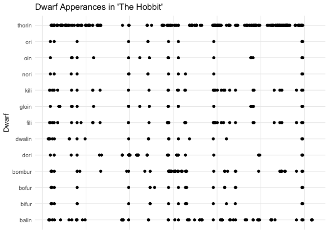

The dwarves sure are a tribal bunch; if Tolkien mentions one of the
background dwarves he almost always mentions the rest of them in the
next breath. It’s hard to tell that Fili is a little bit more important
than his twin Kili from this plot. Balin and Thorin's only noticeable
absence is when Bilbo finds the ring and bests Gollum in a battle of
wits.

 

Word Sentiment
--------------

Using the tidy text package we can analyze word sentiment throughout the
tale. I use two types of sentiment measurements in this analysis.
Descriptive “NRC” package sentiment counts words that express an
emotion, such as anger. Cumulative “AFINN” package sentiment is an
overarching positive / negative word summation. There's a third type of
sentiment library in tidytext, but I forget it's name right now.

 

#### Joyous Sentiment

    nrcjoy <- get_sentiments("nrc") %>%    # using the nrc sentiment package in the tidy text library
      filter(sentiment == "joy")           # using only words that have a sentiment of joy

    happy_cloud <- tidy_hobbit %>%         # put the tidy_hobbit into a new variable
      inner_join(nrcjoy) %>%               # only keep words that match the nrcjoy variable 
      count(word) %>%                      # now count the number of times each word is used
      with(wordcloud(word, n, max.words = 100,  # create a word cloud based on this
                     color = brewer.pal(n = 8,"Dark2")))

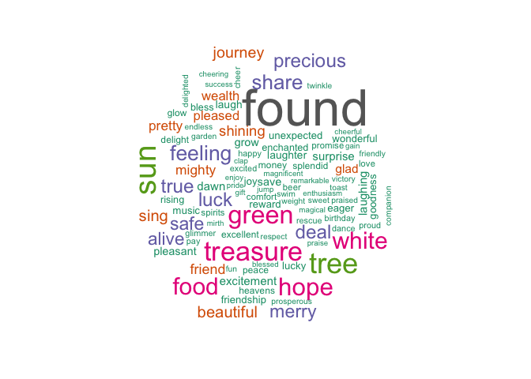

These are the top 100 words Tolkien uses to describe joy in *The
Hobbit*! I think this is the coolest visualization so far. So many of
these adjectives just encompass the adventurous comradery present in the
book.

    joy_meter <- tidy_hobbit %>% 
      inner_join(get_sentiments("nrc")) %>%  # same as above
      filter(sentiment == "joy") %>%
      group_by(index = linenumber %/% 500) %>%  # group joy count by every 500 words
      summarise(sentiment = n()) %>%  # sentiment = number of joy words (per 500 words) 
      mutate(method = "NRC")          # call NRC method from tidy text

    joy_meter %>%                     # plot results
      ggplot(aes(index, sentiment)) +
      geom_col(show.legend = FALSE,
               fill = "orange") + 
      xlab("Book Progression") + 
      ylab("Joy Meter") + 
      labs(title = "Words with Joyous Sentiment in 'The Hobbit'") +
      theme_minimal()

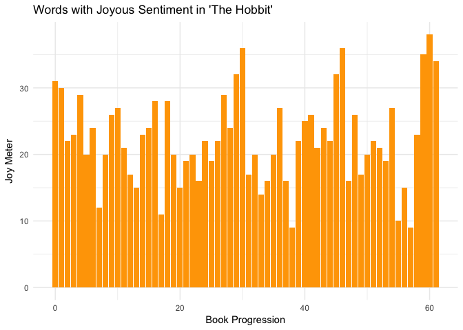

This is a plot of words that express joy as they appear throughout the
book. Each index is 500 meaningful words, so the first bar of the plot
tells us that 31 of the first 500 meaningful (non-stop word) words in
*The Hobbit* express joy.

 

#### Sad Sentiment

    nrcsad <- get_sentiments("nrc") %>%    # from the tidytext
      filter(sentiment == "sadness")

    sad_cloud <- tidy_hobbit %>%
      inner_join(nrcsad) %>%
      count(word) %>%
      with(wordcloud(word, n, max.words = 100,
                     color = brewer.pal(n = 8,"Dark2")))

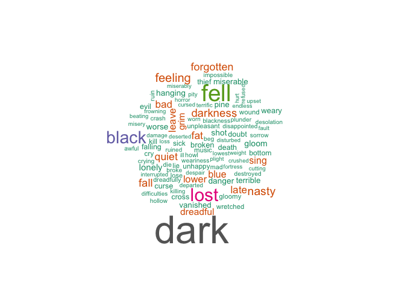

    sad_meter <- tidy_hobbit %>% 
      inner_join(get_sentiments("nrc")) %>% 
      filter(sentiment == "sadness") %>%
      group_by(index = linenumber %/% 500) %>% 
      summarise(sentiment = n()) %>% 
      mutate(method = "NRC")

    sad_meter %>%
      ggplot(aes(index, sentiment)) +
      geom_col(show.legend = FALSE, 
               fill = "lightsteelblue") + 
      xlab("Book Progression") + 
      ylab("Sad Meter") + 
      labs(title = "Words with Sad Sentiment in 'The Hobbit'") +
      theme_minimal() 

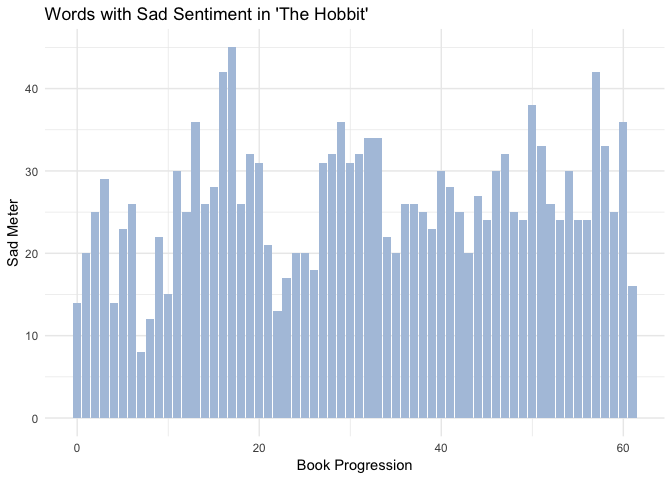

The sad sentiment meter is much higher than the joy sentiment meter,
which is strange because I came away from *The Hobbit* thinking it was a
happy book. The sad words in the word cloud are a bit generic, let's try
analyzing fear throughout the book.

 

#### Fearful Sentiment

    nrcfear <- get_sentiments("nrc") %>%   
      filter(sentiment == "fear")

    fear_cloud <- tidy_hobbit %>%
      inner_join(nrcfear) %>%
      count(word) %>%
      with(wordcloud(word, n, max.words = 100,
                     color = brewer.pal(n = 8,"Dark2")))

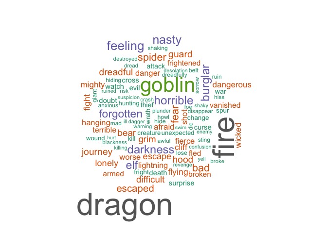

Now this is a good word cloud! Dragon, goblin, fire, escaped, darkness,
spider! This visualization really gives you a feel for all of the
dreadful things Bilbo and the dwarves endured on their quest for
treasure.

    fear_meter <- tidy_hobbit %>% 
      inner_join(get_sentiments("nrc")) %>% 
      filter(sentiment == "fear") %>%
      group_by(index = linenumber %/% 500) %>% 
      summarise(sentiment = n()) %>% 
      mutate(method = "NRC")

    fear_meter %>%
      ggplot(aes(index, sentiment)) +
      geom_col(show.legend = FALSE, 
               fill = "Red4") + 
      xlab("Book Progression") + 
      ylab("Fear Meter") + 
      labs(title = "Words with Fear Sentiment in 'The Hobbit'") +
      theme_minimal()

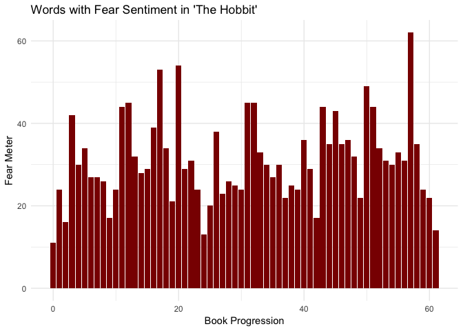

Also pretty high fear counts. Let's see how fear, sadness, and joy stack
up against each other throughout the book.

 

#### All Together Now

    ggplot() + 
      geom_smooth(aes(fear_meter$index,
                      fear_meter$sentiment, 
                      color = "Fear"),
                  se = FALSE) + 
      geom_smooth(aes(joy_meter$index, 
                      joy_meter$sentiment, 
                      color = "Joy"),
                  se = FALSE) + 
      geom_smooth(aes(sad_meter$index, 
                      sad_meter$sentiment, 
                      color = "Sadness"),
                  se = FALSE) + 
      xlab("Book Progression Index") + 
      ylab("Sentiment Index") +
      labs(
        title = "Specific Sentiment in 'The Hobbit'"
      ) + 
      theme_minimal() + 
      scale_color_manual(
        name = "Sentiment",
        values = c("red4", "orange", "lightsteelblue")
      )

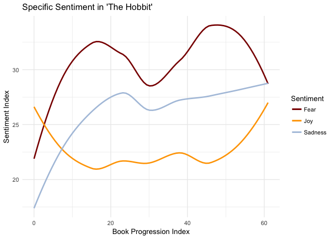

Just as I gathered from the individual meters, *The Hobbit* starts off
cheerful enough but then becomes 300 pages of fear and sadness before a
brief respite in the last chapter or two. But it's hard to be
convienced, *The Hobbit* didn't feel like a scary or dreadful book!
Let's try analyzing this with the AFINN sentiment analysis method.

 

#### AFINN Sentiment

    hobbit_sent <- tidy_hobbit %>% 
      inner_join(get_sentiments("afinn")) %>% 
      group_by(index = linenumber %/% 500) %>% 
      summarise(sentiment = sum(score)) %>% 
      mutate(method = "AFINN")

    hobbit_sent[["sign"]] = ifelse(hobbit_sent[["sentiment"]] >=0, "positive", "negative")     # Creating a sign variable based on positive or negative sentiment

    hobbit_sent %>%
      ggplot() + 
      geom_col(aes(index, 
                   sentiment,
                   fill = sign)
               ) + 
      scale_fill_manual(name = "Sentiment",
                        values = c("positive" = "royalblue4", "negative" = "red4"),  # turning negative sentiment red, positive blue
                        guide = guide_legend(reverse=TRUE)) + 
      xlab("Book Progression Index") + 
      ylab("Sentiment Index") + 
      ggtitle("General AFINN Method Sentiment in 'The Hobbit'") + 
      theme_minimal()

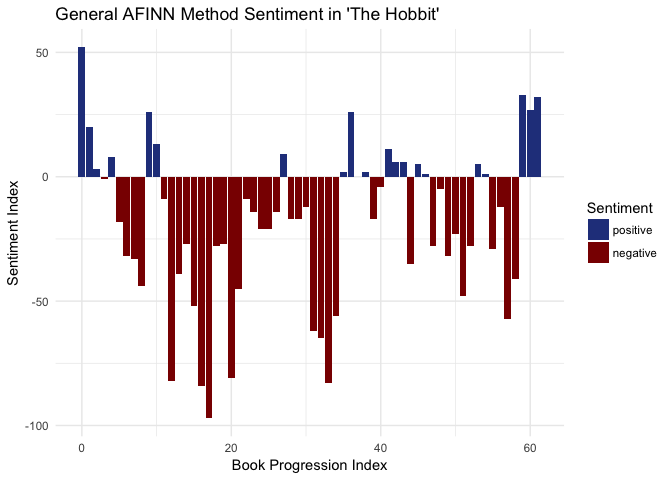

Well I guess that settles it, J.R.R. Tolkien's fantasy novel plainly a
downer. Don't read *The Hobbit* if you're looking for a pick me up! I
guess if anything these results can be used to help build the case for
the power of compliment sandwiches and the like.

There's a lot more you can do with text analysis, but I think this is a
good stopping point for me. Text mining *The Hobbit* has actually been a
really fun project, it made me follow the rabbit-hole of text mining
further than I originally thought I would.

There are many packages and methods for text mining, tidytext is just
the one I happened to stumble upon. Some say that over 70% of the data
created every day isn't nice rectangular datasets, but data embedded in
maps and papers and other sub-optimal mediums. Maybe with the right text
analysis tools and skills skill set, .pdf's don't have to be the place
that data goes to die.

I hope you enjoyed following my own adventure in the realm of text
mining!

Untill next time,

\- Fisher
