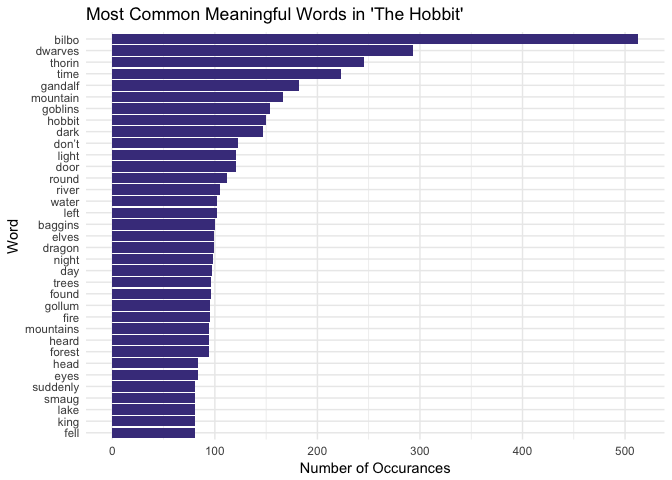
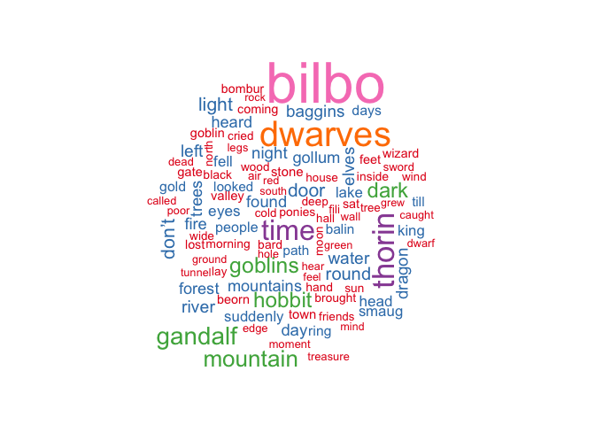
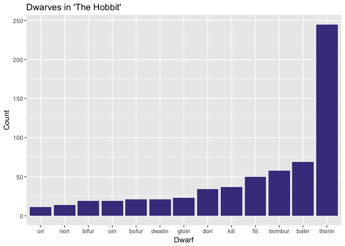
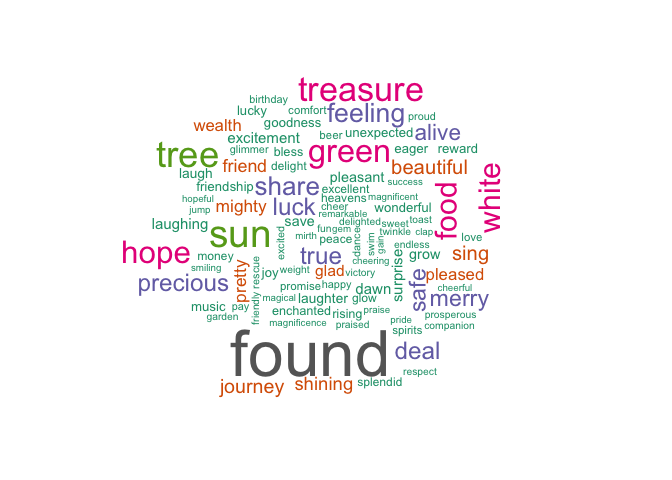
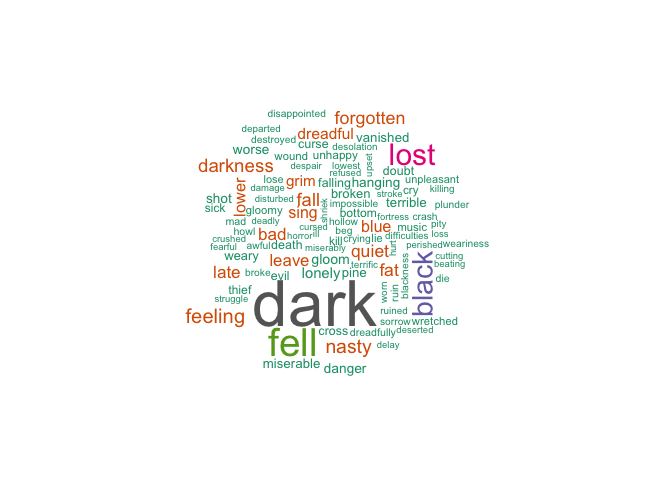
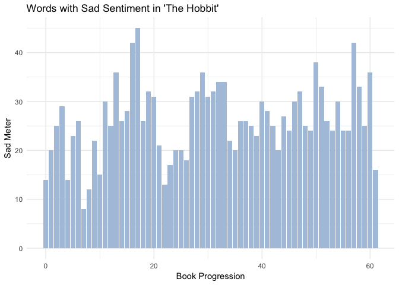
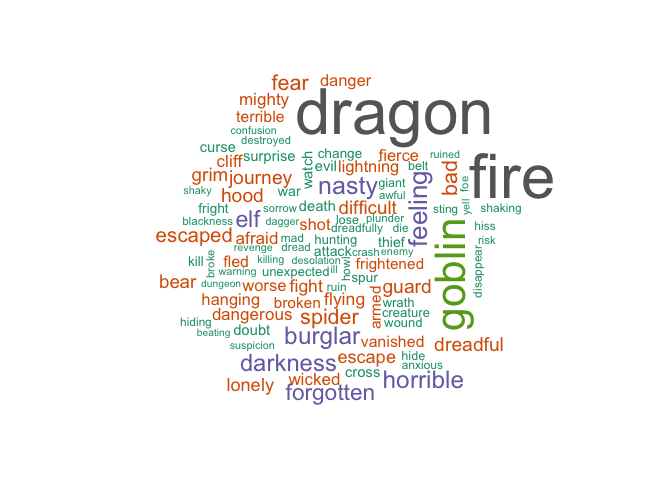

After recently finishing J.R.R. Tolkein's classic, *The Hobbit*, I
decided to try my hand at text mining in R. Now, I've never worked
worked with large strings of text in R before, so I decided to look
around the internet for a little bit of help and inspiration. After
reading about [Text Mining with R](https://www.tidytextmining.com/),
R-Bloggers Metallica lyric analysis
[post](https://www.r-bloggers.com/hardwired-for-tidy-text/), and Data
Camp's text mining blog
[post](https://www.datacamp.com/community/blog/text-mining-in-r-and-python-tips),
I began to understand the challenge that awaited, and what I wanted to
explore in Tolkein's work.

I decided to break up my Hobbit text project into three parts - A
traditional word frequency analysis, An individual character assessment,
and finally various measurements sentiment throughout the novel. If you
want to learn more about text mining in R, or if you're just interested
in hobbits I hope you find this investigation helpful.
[Here](https://archive.org/stream/TheHobbitByJ.R.RTolkien/The%20Hobbit%20by%20J.R.R%20Tolkien_djvu.txt)
is the copy of the hobbit that I'm using if you want to follow along.

First things first, let's load up the libraries we'll be using and tidy
up the dataset.

 

Load Libraries

    library('tidyverse')    # used for EVERYTHING
    library('stringr')      # used for string (text) manipulation
    library('tidytext')     # used for text mining
    library('wordcloud')    # used for creating cool text visualizations

 

Load Data

    the_hobbit <- as.tibble(read_file("input/hobbit_body.txt")) 

 

Tidy Data

    tidy_hobbit <- the_hobbit %>%      # move the_hobbit text into tidy_hobbit
      unnest_tokens(word, value) %>%   # each word is given a cell in tibble
      anti_join(stop_words)            # take out meaningless words lke a, to, and it

 

So here's the first look at our Hobbit text. A quick note: I cleaned up
the hobbit text to start at Chapter 1 before I saved it as an input
file. *head(the\_hobbit)* reveals a 1x1 table with the entire novel
stored as a single string in the tibble. This formatting has some uses
so I'll keep a copy of it, but the tidy text formatted *tidy\_hobbit*
has more uses.

*tidy\_hobbit* has cut out some words - in, a, in, the, there, and so
on. That's the *anti\_join(stop\_words)* at work. *anti\_join()* is a
dplyr function we loaded from the tidyverse, it's job is to return all
rows from x where there are not matching values in y. In this case x is
*the\_hobbit*, y is stop\_words, a tibble from the tidytext library.
Also notice that now each word has it's own row in the tibble, which is
now length over 30,000 elements long.

 

View The Data

    head(the_hobbit)

    ## # A tibble: 1 x 1
    ##   value                                                                   
    ##   <chr>                                                                   
    ## 1 "Chapter I \r\rAN UNEXPECTED PARTY \r\rIn a hole in the ground there li…

    head(tidy_hobbit)

    ## # A tibble: 6 x 1
    ##   word      
    ##   <chr>     
    ## 1 chapter   
    ## 2 unexpected
    ## 3 party     
    ## 4 hole      
    ## 5 ground    
    ## 6 lived

 

### Word Frequency

 

How many words are in *The Hobbit*?

    str_count(the_hobbit, " ") + 1

    ## [1] 95874

 

How many sentences?

    str_count(the_hobbit, "[.!?]")

    ## [1] 5967

 

How long should the book take to read?

    ((str_count(the_hobbit, " ") + 1) / 200) / 60 # number of words / 200 words-per-minute / 60 minutes

    ## [1] 7.9895

 

#### Frequency Plot

What are the most common meaningful words in *The Hobbit*? To find out,
let's create a frequency plot. These overturned bar graphs are some of
my favorite to create.

    tidy_hobbit %>%
      count(word, sort = TRUE) %>%          # count words
      filter(n > 80) %>%                    # only show words that have been used 80+ times
      mutate(word = reorder(word, n)) %>%   # sorts words by decending occurance
      ggplot(aes(word, n)) +                # plot the words vs number of occurances
        geom_col(fill = "darkslateblue") +  # blue bars
      xlab("Word") +                        # labels
      ylab("Number of Occurances") + 
      labs(title = "Most Common Meaningful Words in 'The Hobbit'") +
      coord_flip() +                        # sideways box-plot for aestetic purposes
      theme_minimal()                       # I don't like the gray default theme

The most common words in *The Hobbit* are Bilbo, dwarves, Thorin, time,
and Gandalf. The only non-character word is time, but I bet the word
time is pretty common in most novels. I'm suprised to see the word
"don't" on the list, I would have thought it was classified as a stop
word. There isn't much to be suprised about on this list if you've read
the book. If you haven't read the book, the list gives you a pretty good
idea of what to expect!

 

#### Word Cloud

    hobbit_cloud <- tidy_hobbit %>%
      count(word) %>%                                      # provide a count of each word
      with(wordcloud(word, n, max.words = 100,             # using the wordcloud library, plot word, according to n (number of count), with 100 maximum words)
                     color = brewer.pal(n = 8,"Set1")))    # use RColorBrwer pallete 'Set1'

The top 100 words used in The Hobbit are all jumbled together in this
word cloud. It's basically the same idea as the frequency plot, except
it gives less information in a more artistic way. I'm not sure what's
with the color coding, I would have thought all 8 pallete colors would
be used, not just five. The size of the words reflect their frequency
though.

 

Character Analysis
------------------

Now let's dig into the main characters of the novel. Who are the most
important characters and where do they appear most in the book?

 

#### Main Character Count

    main_chr <- as.tibble(c("bilbo", "thorin", "gandalf", "smaug", "gollum", "bard")) %>%
      unnest_tokens(word, value)

    colnames(main_chr) <- "word"

    main_chr_num <- tidy_hobbit %>% 
      semi_join(main_chr, "word") %>%
      count(word, sort = TRUE) %>%
      mutate(word = reorder(word, n)) %>%
      ggplot(aes(word, n)) + 
        geom_col(fill = "darkslateblue")
    main_chr_num

As we saw before, Bilbo is not only the most important character out of
the six I've ranked, bilbo is the most common word of the entire book.
Life is good being the protagonist! Thorin the dwarf king is mentioned
some 250 times, and Gandalf is mentioned under 200 times. I would have
thought Gandalf played a bigger role than Thorin, but I guess the stats
don't lie. Ol' Gollum, Smaug, and Bard are pretty minor characters.

 

    tidy_hobbit$linenumber <- 1:nrow(tidy_hobbit)

    main_chr_pres <- tidy_hobbit %>% 
      semi_join(main_chr, "word") %>%
      ggplot() + 
      geom_point(
        aes(word, linenumber)
      ) + 
      labs(title = "Main Character Apperances") +
      xlab("Character") + 
      ylab("")+
      coord_flip() + 
      theme_minimal() + 
      theme(axis.title.x=element_blank(),
            axis.text.x=element_blank(),
            axis.ticks.x=element_blank())
    main_chr_pres

By the looks of it, Bilbo is mentioned every other sentence! There's two
small gaps in Bilbos presence near the end of the book where it seems
Bard takes the center stage. Devilish old Smaug is breifly mentioned in
the first half of the book, something along the lines of "oh there's
also a dragon guarding the gold but don't worry about it". Gandalf has
an interesting timeline, he has three solid apperances in the tale,
sitting out for the majority of the story-climatic burglary.

 

#### Dwarf Character Count

    dwarf_chr <- as.tibble(c("dwalin", "balin", "kili", "fili", "dori", "nori", "ori", "oin", "gloin", "bifur", "bofur", "bombur", "thorin")) %>%
      unnest_tokens(word, value)

    colnames(main_chr) <- "word"

    dwarf_chr_num <- tidy_hobbit %>% 
      semi_join(dwarf_chr, "word") %>%
      count(word, sort = TRUE) %>%
      mutate(word = reorder(word, n)) %>%
      ggplot(aes(word, n)) + 
        geom_col(fill = "darkslateblue")
    dwarf_chr_num

Poor Ori. It seems like Oir, Nori, Bifur, Oin, Bofur, Dwalin and Gloin
are nothing but background characters. Fili is mentioned noticably more
than his twin Kili, and the roundest of the dwarves, Bombur is actually
pretty popular in his comic relief. Balin is much more important than
his brother Dwalin, which makes sense as he's the second eldest dwarf
and often the leader of the bunch in Thorin's absence.

 

    dwarf_chr_pres <- tidy_hobbit %>% 
      semi_join(dwarf_chr, "word") %>%
      ggplot() + 
      geom_point(
        aes(word, linenumber)
      ) + 
      labs(title = "Dwarve Apperances") +
      xlab("Dwarf") + 
      ylab("")+
      coord_flip() + 
      theme_minimal() + 
      theme(axis.title.x=element_blank(),
            axis.text.x=element_blank(),
            axis.ticks.x=element_blank())
    dwarf_chr_pres

Ignoring Thorin, Balin, and Bombur, each of the other ten dwarves are
almost always mentioned all together. Fili and Kili's presence is almost
identical, it's hard to spot why Fili is apparently more prominent.

 

Word Sentiment
--------------

Using the tidy text library we can analyze sentiment throughout the
tale. Let's just jump in and start exploring!

    nrcjoy <- get_sentiments("nrc") %>%    # using the nrc sentiment package in the tidy text library
      filter(sentiment == "joy")           # using only words that have a sentiment of joy

    happy_cloud <- tidy_hobbit %>%         # put the tidy_hobbit into a new variable
      inner_join(nrcjoy) %>%               # only keep words that match the nrcjoy variable 
      count(word) %>%                      # now count the number of times each word is used
      with(wordcloud(word, n, max.words = 100,  # create a word cloud based on this
                     color = brewer.pal(n = 8,"Dark2")))

    happy_cloud

    ## NULL

The top 100 words to describe joy in *The Hobbit*! I think this is the
coolest visualization yet. So many of these adjectives just nail the
adventurous spirit and comradery present in the book.

    joy_meter <- tidy_hobbit %>% 
      inner_join(get_sentiments("nrc")) %>% 
      filter(sentiment == "joy") %>%
      group_by(index = linenumber %/% 500) %>% 
      summarise(sentiment = n()) %>% 
      mutate(method = "NRC")

    ## Joining, by = "word"

    joy_meter %>%
      ggplot(aes(index, sentiment)) +
      geom_col(show.legend = FALSE,
               fill = "orange") + 
      xlab("Book Progression") + 
      ylab("Joy Meter") + 
      labs(title = "Words with Joyous Sentiment in 'The Hobbit'") +
      theme_minimal()

joy joy joy

    # Sad Words 
    nrcsad <- get_sentiments("nrc") %>%    # from the tidytext
      filter(sentiment == "sadness")

    sad_cloud <- tidy_hobbit %>%
      inner_join(nrcsad) %>%
      count(word) %>%
      with(wordcloud(word, n, max.words = 100,
                     color = brewer.pal(n = 8,"Dark2")))

    ## Joining, by = "word"

    sad_cloud

    ## NULL

    # Frequency of sadness throught the book
    sad_meter <- tidy_hobbit %>% 
      inner_join(get_sentiments("nrc")) %>% 
      filter(sentiment == "sadness") %>%
      group_by(index = linenumber %/% 500) %>% 
      summarise(sentiment = n()) %>% 
      mutate(method = "NRC")

    ## Joining, by = "word"

    sad_meter %>%
      ggplot(aes(index, sentiment)) +
      geom_col(show.legend = FALSE, 
               fill = "lightsteelblue") + 
      xlab("Book Progression") + 
      ylab("Sad Meter") + 
      labs(title = "Words with Sad Sentiment in 'The Hobbit'") +
      theme_minimal() 

    ## Fearful Words
    nrcfear <- get_sentiments("nrc") %>%   
      filter(sentiment == "fear")

    fear_cloud <- tidy_hobbit %>%
      inner_join(nrcfear) %>%
      count(word) %>%
      with(wordcloud(word, n, max.words = 100,
                     color = brewer.pal(n = 8,"Dark2")))

    ## Joining, by = "word"

    # Frequency of sadness throught the book
    fear_meter <- tidy_hobbit %>% 
      inner_join(get_sentiments("nrc")) %>% 
      filter(sentiment == "fear") %>%
      group_by(index = linenumber %/% 500) %>% 
      summarise(sentiment = n()) %>% 
      mutate(method = "NRC")

    ## Joining, by = "word"

    fear_meter %>%
      ggplot(aes(index, sentiment)) +
      geom_col(show.legend = FALSE, 
               fill = "Red4") + 
      xlab("Book Progression") + 
      ylab("Fear Meter") + 
      labs(title = "Words with Fear Sentiment in 'The Hobbit'") +
      theme_minimal()

    ### Happy, Sad, and Fear all together now
    ggplot() + 
      geom_smooth(aes(fear_meter$index,
                      fear_meter$sentiment, 
                      color = "Fear"),
                  se = FALSE) + 
      geom_smooth(aes(joy_meter$index, 
                      joy_meter$sentiment, 
                      color = "Joy"),
                  se = FALSE) + 
      geom_smooth(aes(sad_meter$index, 
                      sad_meter$sentiment, 
                      color = "Sadness"),
                  se = FALSE) + 
      xlab("Book Progression Index") + 
      ylab("Sentiment Index") +
      labs(
        title = "Specific Sentiment in 'The Hobbit'"
      ) + 
      theme_minimal() + 
      scale_color_manual(
        name = "Sentiment",
        values = c("red4", "orange", "lightsteelblue")
      )

    ## `geom_smooth()` using method = 'loess'
    ## `geom_smooth()` using method = 'loess'
    ## `geom_smooth()` using method = 'loess'

    # Overall Sentiment
    hobbit_sent <- tidy_hobbit %>% 
      inner_join(get_sentiments("afinn")) %>% 
      group_by(index = linenumber %/% 500) %>% 
      summarise(sentiment = sum(score)) %>% 
      mutate(method = "AFINN")

    ## Joining, by = "word"

    hobbit_sent[["sign"]] = ifelse(hobbit_sent[["sentiment"]] >=0, "positive", "negative")

    hobbit_sent %>%
      ggplot() + 
      geom_col(aes(index, 
                   sentiment,
                   fill = sign)
               ) + 
      scale_fill_manual(name = "Sentiment",
                        values = c("positive" = "royalblue4", "negative" = "red4"),
                        guide = guide_legend(reverse=TRUE)) + 
      xlab("Book Progression Index") + 
      ylab("Sentiment Index") + 
      ggtitle("General AFINN Method Sentiment in 'The Hobbit'") + 
      theme_minimal()

the end
